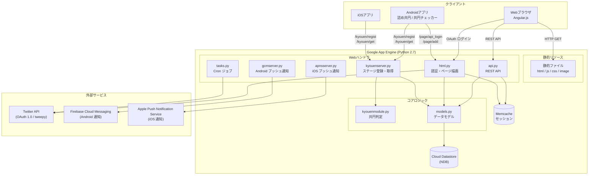
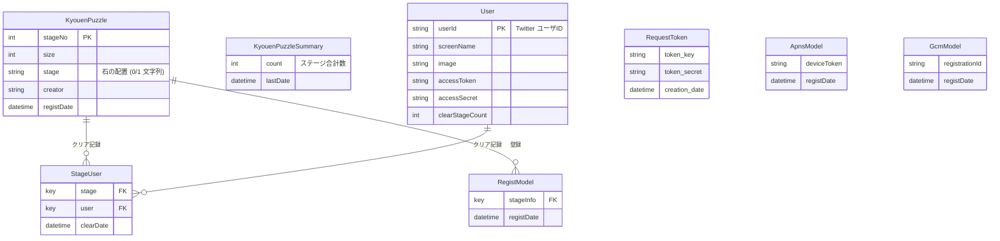
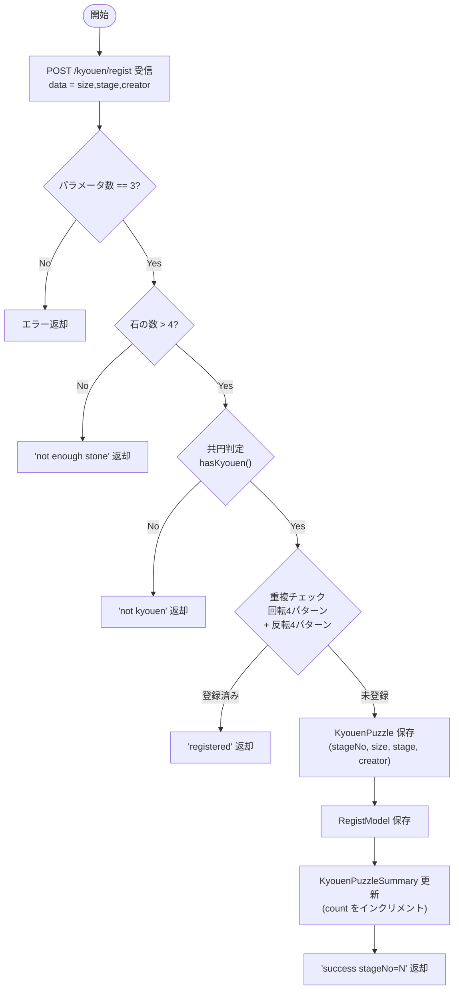
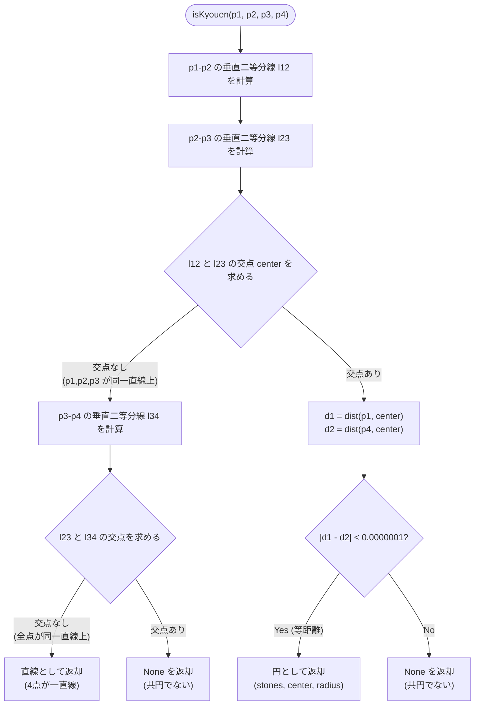
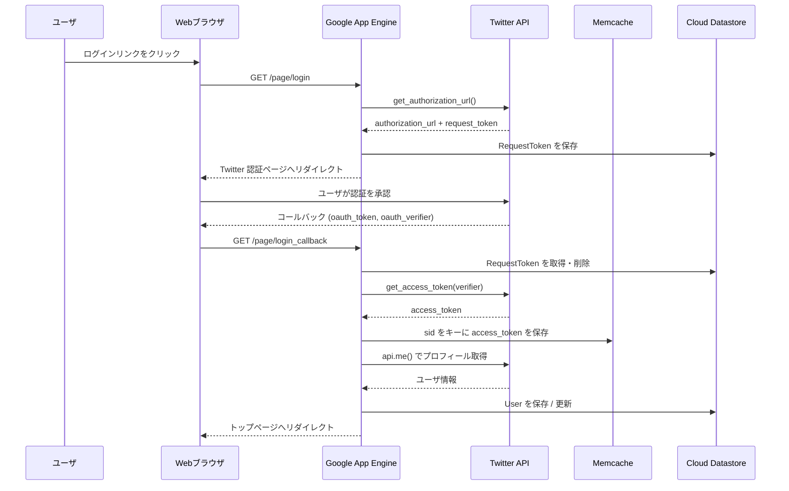
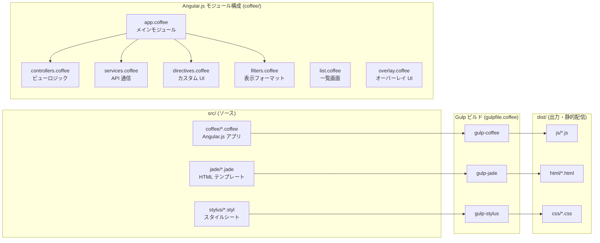

# アーキテクチャ構成図

## 1. 全体構成図

システム全体の構成を示します。

---

## 2. データモデル図

Cloud Datastore (NDB) 上のエンティティとその関係を示します。

---

## 3. ステージ登録フロー

モバイルアプリからのステージ投稿処理 (`POST /kyouen/regist`) を示します。

---

## 4. 共円判定アルゴリズム

`kyouenmodule.py` の `isKyouen()` 関数が行う、4点が共円かどうかの判定ロジックを示します。

**`hasKyouen()`** は石の座標リストから4点の組み合わせをすべて列挙し、いずれかが `isKyouen()` を満たす場合に `True` を返します。

> **epsilon について**: 距離差の許容誤差 `0.0000001` は、浮動小数点演算の丸め誤差を吸収するための値です。格子点座標を扱うため、厳密な等号ではなくこのしきい値で同距離を判定します。

---

## 5. Twitter OAuth 認証フロー

Webブラウザからの Twitter OAuth 1.0 ログイン処理を示します。

---

## 6. フロントエンド構成図

CoffeeScript / Jade / Stylus から Gulp でビルドして静的ファイルを生成する構成を示します。

